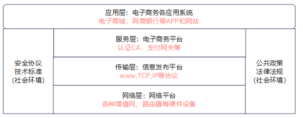

# 电子商务基础知识
## 电子商务的概念
简单定义：`电子商务是以电子形式进行的商务活动`<br>
电子商务是以信息网络技术为手段，以商品交换为中心的商务活动。“电子商务”，“电子”是一种技术，是一种手段，而“商务”才是最核心的目的，一切的手段都是为了达成目的而产生的。

## 电子商务的分类
* **按参与对象分类**：
  - B2C
  - B2B
  - C2C
  - B2G
  - G2C
* **按交易内容分类**：
  - 直接电子商务（无形商品）
  - 间接电子商务（有形商品）
  -  `记忆：商品能不能直接通过网线传输`
* **按网络类型分类**：
  - EDI（电子数据交换）
  - Internet（国际互联网）
  - Intranet(企业内部网)
  - Extranet（企业外部网）<br>
```
下列不属于按电子商务参与对象的分类方法是（ ） 
A、B2C    
B、直接电子商务    
C、间接电子商务   
D、B2B
``` 
## 电子商务的体系
* 电子商务系统框架结构<br>


```
认证中心属于电子商务系统框架结构中的（  ）
A、网络平台
B、信息发布平台
C、电子商务平台
D、电子商务各应用系统

电子商务系统的框架结构中（  ）又称为电子商务平台
A、网络层
B、应用层
C、服务层
D、传输层
```
## 电子商务的安全协议
* 安全超文本传输协议（S-HHTTP,HTTPS)---主要保障web网站数据的安全
* 邮件协议（SMTP,POP3)---SMTP:负责将邮件发到服务器，POP3：负责从服务器下载到本地
* 安全.套接层协议（SSL）--主要保障web网站之间通信信道安全
* 安全电子交易协议（SET）--主要保障`信用卡`支付安全
```
下列说法错误的是（ ）
A、电子商务的安全协议中的HTTP的作用是保障web网站数据的安全
B、电子商务的安全协议中的S/MIME的作用是保障电子邮件的安全传输
C、电子商务的安全协议中的SET的作用是保障用户，商家和银行之间通过电子信用卡支付的安全
D、电子商务的安全协议中的SSL的作用是保障web网站之间通信信道的安全
```
## 电子商务系统的组成
- 客户（购物单位，消费者）
- 供货方（厂家，商户，电子商城）
- 银行（收单银行，发卡银行，`支付网关`）
- `认证中心`（身份认证，诚信认证，时间认证）
- 销售中心（电子商城，服务提供商）
- 配送中心（物流公司，邮政局）

## 电子商务交易过程
**电子商务一般的交易过程可分为5个阶段，分别如下：**
* **交易前准备：** 市场调查、发布广告、其他如银行海关物流等做好准备
* **洽谈和签字合同：** 通过电子邮件，电子公告牌（BBS），网络新闻组（usenet）等进行洽谈
* **办理合同履行前手续：** 信用卡申请、支付能力查证、支付信誉查证、账号及密码校验等
* **交易合同履行：** 备货、发货、报关、送货等
* **交易后处理：** 售后服务，违约处理，索赔等
```
电子商务一般的交易过程分为五个阶段，“买卖双方完成必要手续之后，随着物流、信息流和资金流，卖方要按约给出发货通知，
启动相应机构完成对应服务项目，进行备货、发货、报关、保险、取证、信用等业务。”这些行为属于(   )。	
A.洽谈和签订合同阶段	
B.交易合同履行阶段	
C.办理合同履行前手续阶段
D.交易前准备阶段
```
## EDI
简单理解：各国语言不同、标准不同、格式不同怎么办？----使用EDI(电子数据交换)统一标准，各方必须按照标准进行数据传输。
```
下列哪个是EDI的特点？（  ）
A、它成功地应用于同类组织之间的电子贸易
B、统一采用世界公认的国际标准
C、贸易链上的各个环节或行政事务的各个单位不能共享一次性输入的数据
D、所传送的资料文件无须格式化的
```