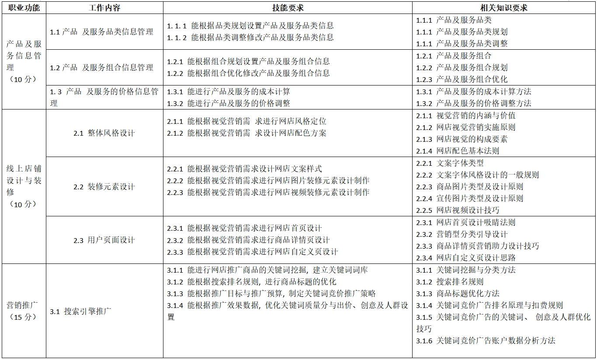
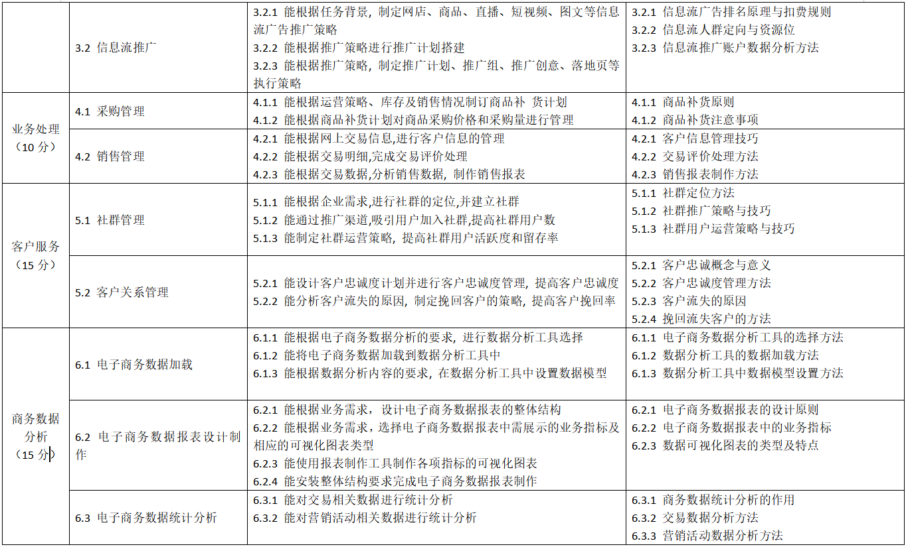

# 国家职业技能标准
?> 职业编码:4-01-02-02

?> 2022年版

## 申报条件
具备以下条件之一者,可申报三级/高级工
1. 取得本职业或相关职业四级/ 中级工职业资格证书 技能等级证书. 后, 累计从事本职业或相关职业工作 5 年含. 以上。
2. 取得本职业或相关职业四级/ 中级工职业资格证书 技能等级证书., 并具有高级技工学校、 技师学院毕业证书 含尚未取得毕业证书的在校应届毕业生.; **或取得本职业或相关职业四级/ 中级工职业资格证书 技能等级证书., 并具有经评估论证、 以高级技能为培养目标的高等职业学校本专业或相关专业②毕业证书 含尚未取得毕业证书的在校应届毕业生.。**
3. 具有大专及以上本专业或相关专业毕业证书, 并取得本职业或相关职业四级/ 中级工职业资格证书 技能等级证书. 后, 累计从事本职业或相关职业工作 2 年 含. 以上。
4. 取得本科院校本专业或相关专业毕业证书 含尚未取得毕业证书的在校应届毕业生., 在电子商务工作岗位实习半年。

## 鉴定方式
分为理论知识考试、 技能考核以及综合评审。 理论知识考试主要采用笔试、 机考等方式进行, 主要考核从业人员从事本职业应掌握的基本要求和相关知识要求; 技能考核主要采用现场操作、 模拟操作、 机考等方式进行, 主要考核从业人员从事本职业应具备的技能水平;综合评审主要针对技师和高级技师, 通常采取审阅申报材料、 答辩等方式进行全面评议和审查。理论知识考试、 技能考核和综合评审均实行百分制, 成绩皆达60 分 含. 以上者为合格。

## 基本要求
### 职业道德(5分)
#### 职业道德基本知识
#### 职业守则
   1. 遵纪守法,爱岗敬业.
   2. 诚信为本,热情服务.
   3. 保守秘密,注重安全.
   4. 用于开拓,积极创新.

### 基础知识（20分）
#### 网络应用基础
1. 网络基础知识.
2. web浏览技术知识.
3. 网络安全知识.
4. 数据库基础知识.
5. 互联网应用知识.
6. 网上银行基础知识.
7. 网上商店基础知识.
8. 电子政务知识.

#### 电子商务基本概念
1. 电子商务框架知识.
2. 电子商务模型知识.
3. 电子交易行业应用知识.

#### 网络营销基础
1. 网络营销基本概念.
2. 网络营销基本方法.
3. 网络营销基础操作.
4. 网络营销特点与优势.

#### 商品基础
1. 商品流通基础知识.
2. 商品流通环节知识。
3. 商品流通分类知识。
4. 商品流通渠道知识。
5. 商品编码知识。
6. 商品编码管理知识。

#### 物流基础
1. 物流基本概念。
2. 物流管理基础知识。
3. 物流操作方法。
4. 物流流程控制。

#### 网络客户服务基础
1. 网络客户服务基本概念。
2. 网络客户服务主要方法。
3. 网络客户服务基本原则。
4. 网络客户服务注意事项。

#### 网上支付知识
1. 网上支付基本概念。
2. 第三方支付平台知识。
3. 第三方支付平台分类。
4. 第三方支付平台特点。

#### 电子商务安全基础知识
1. 交易安全基础知识。
2. 交易注意事项。
3. 交易管理办法。
4. 文件加密与解密知识。
5. 数字证书管理基础知识。
6. 安全防护基础知识。

#### 数据分析基础知识
1. 商务数据分析基本概念。
2. 商务数据分析基本方法。
3. 商务数据分析指标体系。

#### 财务分析及投资方案基础
1. 财务数据分析基本概念。
2. 投融资方案设计基本方法。

#### 相关法律法规基础知识
1. 《中华人民共和国民法典》 相关知识。
2. 《中华人民共和国劳动法》 相关知识。
3. 《中华人民共和国合同法》 相关知识。
4. 《中华人民共和国劳动合同法》 相关知识。
5. 《中华人民共和国网络安全法》 相关知识。
6. 《中华人民共和国广告法》 相关知识。
7. 《中华人民共和国商标法》 相关知识。
8. 《中华人民共和国产品质量法》 相关知识。
9. 《中华人民共和国消费者权益保护法》 相关知识。
10. 《中华人民共和国反不正当竞争法》 相关知识。
11. 《中华人民共和国价格法》 相关知识。
12. 《中华人民共和国电子商务法》 相关知识。
13. 《中华人民共和国数据安全法》 相关知识。
14. 《中华人民共和国个人信息保护法》 相关知识。
15. 《互联网直播服务管理规定》 相关知识。
16. 《关于加强网络直播营销活动监管的指导意见》 相关知识。
17. 《网络交易监督管理办法》 相关知识。
18. 《网络直播营销管理办法 试行.》 相关知识。

## 工作要求

